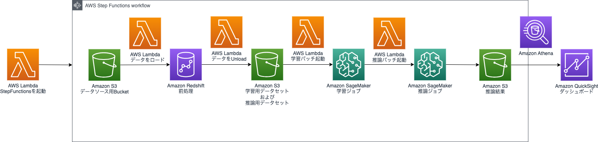

# ソリューション・アーキテクチャ

## アーキテクチャ

下記の一連の流れが AWS Step Functions により自動的に実行されます

1. Amazon S3のデータソース用バケットに保存されたデータは Amazon Redshift Serverless にロードされます。日次での連携を想定しているため、日付ごとに prefix がわかれています
2. Amazon Redshift Serverless ではデータの前処理が行われます。具体的には予測のためのアルゴリズムであるLightGBM で使うための特徴量の形に加工されます
3. 前処理されたデータは学習データセットと推論データセットとしてS3バケットに保存されます
4. Amazon SageMaker Training Job が起動し、Amazon SageMaker built-in algorithm の一つである LightGBM によって、一日後の商品ごと、店舗ごとの商品の売上数量を予測するための機械学習モデルが作成されます
5. Amazon SageMaker Batch Transform Job が起動し、推論を実行します。推論結果は Amazon S3 に保存されます
6. 推論結果は Amazon QuickSight に連携され、ダッシュボードとして閲覧することができます

## アーキテクチャのポイントおよび注意点

* この実装では日次で、毎日深夜に日付が変わった後に、前日のデータが Input 用の Amazon S3 バケットに格納されることを想定しています。

* 日次での実行を想定していますが、起動するためのトリガーは実装に含まれていません。[Amazon EventBridge Scheduler](https://docs.aws.amazon.com/ja_jp/eventbridge/latest/userguide/scheduler.html)などを設定し、[WorkFlowStarterのLambda関数](/lib/stepfunctions.ts#L95)を起動することを推奨いたします

* Amazon Redshift の WorkGroup、データベース、テーブルなどのリソースは、cdk のカスタムリソースによってデプロイされます。その際、原則としてcdk実行Roleによって作成されますが、外部テーブルのみ admin ユーザによって作成されます。このadmin ユーザの情報は [AWS SecretsManager](https://docs.aws.amazon.com/ja_jp/secretsmanager/latest/userguide/intro.html) によって管理されます

* AWS Step Functions のStateMachineがスタートすると、まず Amazon Redshift にダミーの SQL を発行し、10分間の Wait しています。これは、バッチ実行時に Amazon Redshift Serverless がアクティブになっていることを確実にするためです

* エラー発生時の対応はソリューションでは実装しておりません。業務要件を鑑みて必要に応じて実装してください。特に下記について考慮に入れ、ご検討願います
  * データの Amazon Redshift へのロードから前処理、Amazon SageMaker による推論まで、すべての処理は AWS Step Functions の State Machine の中で、原則として冪等に行われます。従って、単純なリトライを実行することで状態の回復が可能な場合があります
  * Amazon CloudWatch Logs を監視し、エラーログの出力によってアラートを通知することをご検討ください

* Amazon Redshift、AWS Lambdaなどの各リソースの引き受ける IAM Role に付与された権限をはじめ、セキュリティについては、本番システムの開発の際には組織のセキュリティポリシに従い改めて評価と実装をお願いいたします