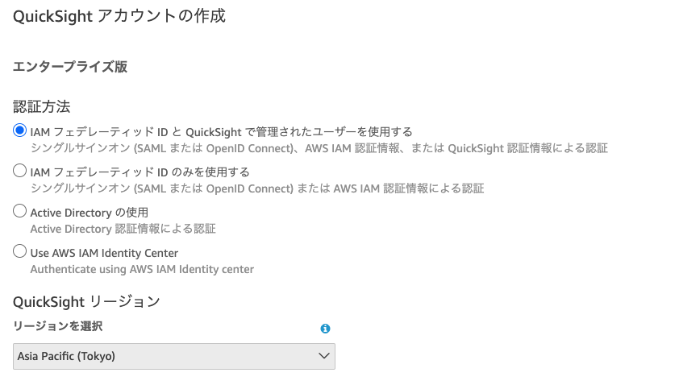
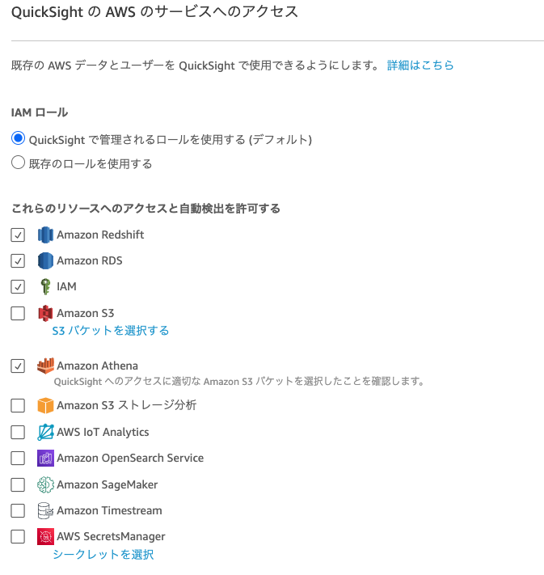
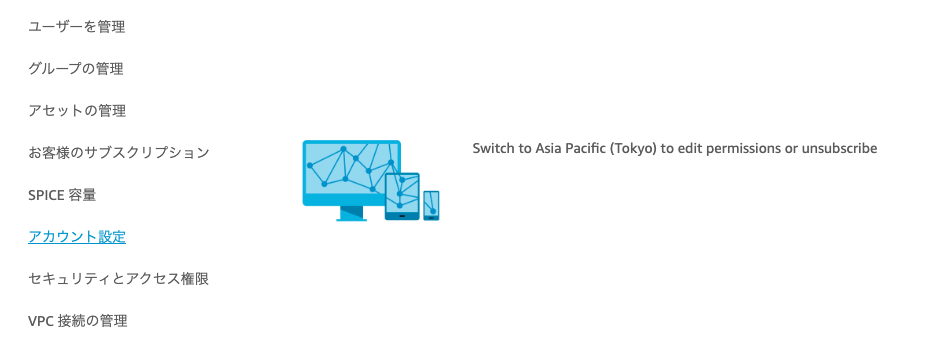
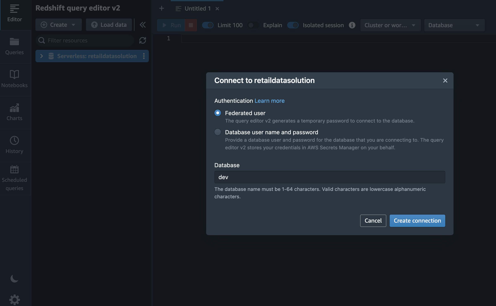
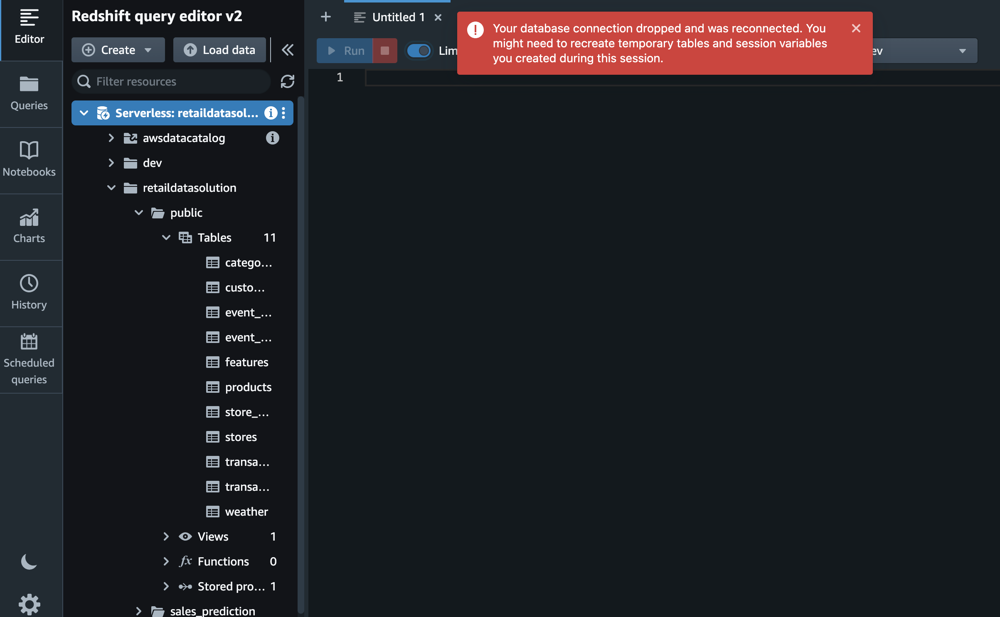

# クイックスタートガイド

## 本ソリューションについて

本ソリューションは、小売業を想定して、既存のデータを取り込み、BIによる可視化や機械学習による在庫予測を実現するためのサンプル実装を提供します。

本ソリューションを利用することで、Amazon S3上のデータをAmazon Redshiftに取り込み、必要な前処理を実施したうえで、Amazon SageMakerで予測を実施し、結果をAmazon AthenaやAmazon QuickSight で閲覧するまでのシステムを簡単に構築できます。詳細は[本ソリューションについて](Readme.md)、もしくは[アーキテクチャ](docs/architecture.md)を参照してください。

ソリューションの免責事項については[免責事項](docs/disclaimer.md)をご確認ください。

本資料では本ソリューションのデプロイの方法を説明します。

## デプロイの準備

本ソリューションは東京リージョンでの実行を前提としています。以下の作業は東京リージョンで実施する必要があります。また、実行するIAMユーザーには管理者権限があることを前提とします。

1. Amazon QuickSightの準備

Amazon QuickSightをまだ利用したことがない場合はAmazon QuickSightのサインアップが必要です。サインアップの手順については[Amazon QuickSight ユーザーガイド](https://docs.aws.amazon.com/ja_jp/quicksight/latest/user/signing-up.html)をご確認ください。

東京リージョンでAmazon QuickSightにアクセスし、Enterprise Editionでサインアップします。Get Pagenated Report add-onは本ソリューションをお試しする限りであれば不要です。Authentication method(認証方法)は、デフォルトで選択されているUse IAM federated identities & QuickSight-managed users(IAM フェデレーティッド ID と QuickSight で管理されたユーザーを使用する)のままにしておきます。QuickSightリージョンを"Asia Pacific (Tokyo)"に変更します（ブラウザが日本語表示優先となっている場合は、このタイミングで日本語表示に変わります）。これにより、QuickSightのサインアップリージョンが東京リージョンになります。QuickSightアカウント名と通知のEメールアドレスには適切なものを入力します。



QuickSight の AWS のサービスへのアクセスについては、最低限Amazon RedshiftとAmazon Athenaへのアクセスを許可しておきます。これらはデフォルトで選択済みとなっています。サインアップ完了時の画面にある「Amazon QuickSightに移動する」ボタンをクリックしてQuickSightのスタートページに移ります。



2. Amazon QuickSightの管理者ユーザー名をメモ

後ほどCDKに設定するためにQuickSightのユーザー名をメモします。CDKでデプロイしたDataSetへのアクセス権を付与するために必要です。前項でQuickSightにサインアップした場合は管理者ユーザーでログイン済みになっています。既存のQuickSightアカウントを利用する場合は、管理者ユーザーでログインしてください。ユーザー名は、画面右上の人型のアイコンをクリックすることで確認することが可能です。サインアップした環境によっては途中にスラッシュが入った表記になっている場合がありますが、そのスラッシュも含めた文字列がユーザー名となります。

3. Default VPC

このソリューションでは Default VPC の存在を期待しています。必ず Default VPC がある状態でデプロイいただくようにお願いします。

4. 実行環境の準備

次のデプロイ手順では、node.js, aws cli v2, docker の3つのツールを使用します。実行するPCにこれらをインストールするか、AWS Cloud9を使って実行環境を準備します。以下にAWS Cloud9を使った手順を記します。

AWSマネジメントコンソールより、東京リージョンを選択してAWS Cloud9のページに進み、「環境を作成」ボタンをクリックして環境作成画面へ進みます。環境タイプとしてEC2インスタンスを選択します。デフォルトのt2.microよりサイズの大きいt3.small以上を選択することをお勧めします。プラットフォームはAmazon Linux 2とします。「作成」ボタンをクリックして環境を作成します。作成したらCloud9 IDEを開きます。

作成された環境で使用されているAmazon EBSボリュームは、初期サイズの10GBではデプロイの途中でdisk fullでエラーとなります。そのため、[環境で使用されている Amazon EBS ボリュームのサイズ変更](https://docs.aws.amazon.com/ja_jp/cloud9/latest/user-guide/move-environment.html#move-environment-resize)の手順に従って、100GBなどにサイズを拡張します。具体的には、手順の中にあるスクリプトをresize.shなどといったファイル名で保存し、Cloud9にアップロードします。アップロードはIDE画面の左上、Fileメニューから、Upload Local Filesを実行することで可能です。ファイルをアップロードしたら、IDE下部のコマンドプロンプトから以下のコマンドを実行してボリュームを拡張します（下の例では100GBに拡張）。

``` bash
bash resize.sh 100
```

5. コードのダウンロード

本ソリューションのコードはGitHubの本ソリューションのトップページ、「Code」ボタンから「Download ZIP」することでダウンロード可能です。gitが利用可能な環境の方であれば、git cloneでも構いません。ダウンロードしたファイルは前手順で用意した実行環境上に展開してください。Cloud9の場合は画面左上のFileメニューからUpload Local FilesからZIPファイルをアップロードし、unzipコマンドで展開します。

## How to deploy

1. cdk.jsonを編集

本ソリューションのルートディレクトリにある、cdk.jsonファイルを編集します。ファイル末尾に定義されているquickSightAdminArnに、AWSアカウントIDとメモした管理者ユーザー名をフォーマットを揃えて設定します。AWSアカウントIDにはハイフンは不要です。この表記内にはQuickSightをサインアップしたリージョンを入力する必要があります。本手順でサインアップした場合は東京(ap-northeast-1)ですが、既存のQuickSightアカウントを利用する場合は東京とは異なるリージョンである可能性があります。その場合にはサインアップしたリージョンを入力してください。

例）
```
arn:aws:quicksight:(サインアップリージョン):(AWSアカウントID):user/default/(userID)
```

サインアップしたリージョンを確認する簡単な方法として、QuickSight管理画面の「アカウント設定」を開く方法があります。右上の人型のアイコンから「QuickSightの管理」を選び、開いた管理画面から「アカウント設定」を選択します。サインアップしたリージョンであればそのまま設定画面が開きますが、サインアップしたリージョンではないリージョンの場合は、サインアップしたリージョンにスイッチすることを促す以下のような画面が開きます。



2. Amazon ECR へのログイン

ここからはコマンドラインでの作業となります。Cloud9 IDEでは、画面下部のターミナルウインドウを利用します。
下記コマンドで ECR に docker login します。ログインが成功すると、`Login Succeeded`と出力されます。（補足：本ソリューションは東京リージョン上にデプロイされますが、以下コマンドでus-east-1を指定しているのは正しい表記です）

```bash
aws ecr-public get-login-password --region us-east-1 | docker login --username AWS --password-stdin public.ecr.aws
```


3. パッケージインストール

下記コマンドを実行し、パッケージをインストールします。

``` bash
npm ci
```


4. CDKのブートストラップ

下記コマンドを実行し、CDKをブートストラップします。

``` bash
npm run cdk bootstrap
```


5. CDKのデプロイ

続けて以下のコマンドを実行し、CDKをデプロイします。実行途中で、IAMポリシーの変更を実施するかどうかを問うプロンプト`Do you wish to deploy these changes (y/n)?`が表示されます。yと入力して処理を続行させます。

``` bash
npm run cdk -- deploy --all
```

ここまででコマンドラインでの作業は終了です。次からはAWSマネジメントコンソール(Webブラウザ)上での作業となります。

### Operation

1. Redshift Serverless上にテーブルを作成

AWSマネジメントコンソールからAWS Lambdaを開きます。Lamdba関数の一覧の中から`RetailDataSolutionStack-RedshiftInitXXX`（XXXの部分は任意の長さのランダムな文字列です。以降の説明でも同様です）のLambda関数を開き、画面下部の`Test`タブを開きます。右にある「テスト」ボタンをクリックして実行します。

実行が完了したら、Redshift Query Editor v2からテーブルが作成されたことを確認することができます。AWSマネジメントコンソールからAmazon Redshiftを開きます。画面左上の横線３本のアイコンをクリックしてメニューを開き、「クエリエディタv2」をクリックします。初めて実行した時は「Configure account」という画面が出ますので、右下の「Configure account」ボタンをクリックします。Query Editor v2の画面が開き、左側のデータベース一覧にRedshift Serverlessが存在しているのがわかります。Serverlessの名称の左側の「>」をクリックすると認証画面が出ますので、「Federated user」（デフォルトで選択済み）を選んで「Create connection」をクリックします。



Serverlessの下にデータベースの一覧が現れますので、「retaildatasolution」--> 「public」--> 「Tables」と開きます。11個のテーブルが作成されていることがわかります。なお画面上部に「Your database connection dropped and was reconnected.」から始まるポップアップ表示が出る場合がありますが、今回は無視して構いません。



2. S3のディレクトリ作成

AWSマネジメントコンソールからAmazon S3を開きます。`retaildatasolutionstack-inputbucketXXX`のS3バケットを開きます。まず処理対象日付のディレクトリ(prefix)をYYYY-MM-DD形式で作成し、その下に下記のディレクトリ(prefix)を作成します。

- categories
- customers
- event_calendar
- products
- stores
- transaction_details
- transactions
- weather

次のテストデータを使ったテストでは以下の日付を用いていますので、処理対象日付として以下のディレクトリ(prefix)を作成してください。

 - 2023-04-01
 - 2023-04-15
 - 2023-04-16
 - 2023-04-17

補足）[Prefix作成サンプルスクリプト](/test/gen_s3dir.sh)（環境変数INPUTBUCKETにバケット名を指定、PROCESSINGDATEにyyyy-mm-ddで処理対象日付を指定）を利用することで、コマンドラインからS3フォルダ(prefix)を簡単に作成することができます。まず対象のS3バケット名(`retaildatasolutionstack-inputbucketXXX`の正しい名称)をメモします。gen_s3dir.shのあるディレクトリへ移動して、以下のコマンドを実行してください。INPUTBUCKET環境変数は、メモしたS3バケット名に置き換えてください。


``` bash
export INPUTBUCKET=xxxxxxxxx
for GENDATE in 2023-04-01 2023-04-15 2023-04-16 2023-04-17
do
export PROCESSINGDATE=${GENDATE}
bash gen_s3dir.sh
done
```

3. テストデータをアップロード

[./test/smalldata](./test/smalldata/)の各ファイルをS3で作成したそれぞれのディレクトリ(prefix)配下にアップロードします（customers/にはデータを入れる必要はありません）。全ての日付に同じファイルをアップロードすることとなります。

4. ワークフローキック

AWSマネジメントコンソールからAWS Lambdaを開きます。`RetailDataSolutionStack-WorkFlowStarterXXX`のLambda関数を開きます。、`Test`タブを開き下にスクロールしてEvent JSONの入力画面を表示します。下記のようにprocessingDateと日付を指定するようにJSONを書き換えます。このprocessingDateが処理対象日付がとなります。これを、先ほどS3バケットのフォルダ(prefix)として作成した2023-04-01と指定し、右の「テスト」を実行します。

``` json
{
  "processingDate": "2023-04-01"
}
```

Lambda関数の実行はすぐ終わりますが、処理はAWS Step Functionsにて実行されています。AWSマネジメントコンソールからAWS Step Sunctionsを開き、メニューから「ステートマシン」を開くと、実行中のステートマシンの状態を確認することができます。最初に処理日付として2023-04-01を指定した処理は処理後半のTrainingKickerでエラーとなりますが、問題ありません。エラー終了したら、先ほどと同様にEvent JSONのprocessingDateに2023-04-15, 2023-04-16, 2023-04-17と指定して、順にLamdba関数を実行します。最後の2023-04-17の時に、最後まで処理が実行されて成功するはずです。

5. QuickSightまたはAthenaで確認

推論結果がAmazon S3のバケットに出力されていますので、Amazon Athenaから確認するか、Amazon Athena経由でAmazon QuickSightからアクセスをします。CDKのデプロイによって、QuickSight上にデータセットretaildatasolutionstack-datasetが作成されています。それをつかって分析を作ることができれば成功です。

Amazon Athena上で確認するには、Amazon Athenaのコンソールにアクセスし、クエリエディタから`設定`を選択し、`クエリの結果の場所`に任意のバケットを指定してください。

次にクエリエディタの左側を確認すると、`sales_prediction`表ができています。それをSELECTすることで予測値が確認できます。

## 本番システム開発時の考慮事項

このソリューションはデプロイし、当ドキュメントに従うだけでサンプルデータセットを使って学習と推論を簡単に試すことができますが、各お客様にて本番のシステム開発に統合する際には例えば下記のような考慮事項が考えられます

- あくまでもサンプルコードであるため、不具合などに対する保証はございません。([免責事項](/docs/disclaimer.md))
- Amazon Redshiftのテーブルスキーマなど、データレイアウトについてはお客様のシステムに合わせてカスタマイズいただく必要がございます。詳細は[カスタマイズガイド](docs/how-to-customize.md)を参照してください。
- データソース用バケットのパス構造は固定となっています。実システムの開発の際には、すでに稼働している基幹システムとの統合などが必要になります。
